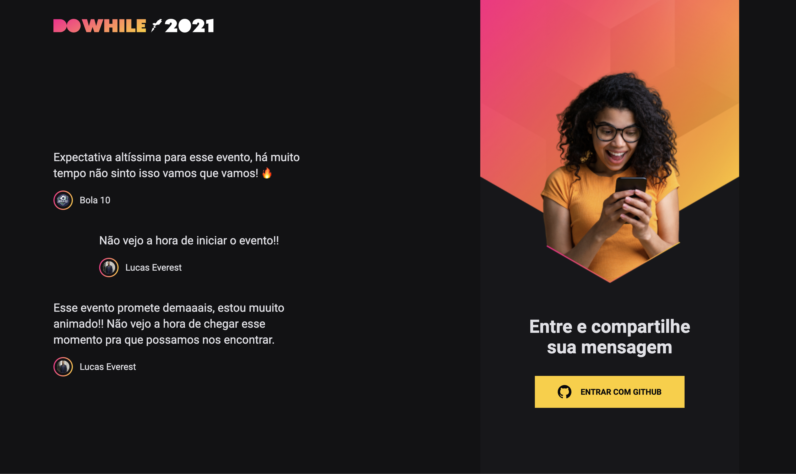
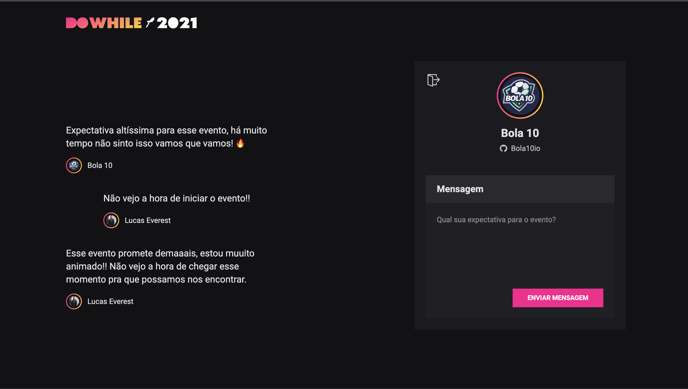

<h1 align="center">NLW Heat - FrontEnd - React.js</h1>

Next Level Week is a [Rocketseat](https://www.rocketseat.com.br/) event to learn programming by building a complete application.

BackEnd repository: [nlw-heat-backend](https://github.com/lucaseverest/nlw-heat-backend)

## 💻 Main Technologies

- [TypeScript](https://www.typescriptlang.org/)
- [Vite](https://vitejs.dev/)
- [Sass](https://sass-lang.com/)
- [Socket.IO](https://socket.io/)
- [React.js](https://reactjs.org/)

## 🔌 Getting started

```sh
# clone repo
git clone https://github.com/lucaseverest/nlw-heat-frontend.git

# Install the dependencies
yarn

# Start the project
yarn dev
```

## :framed_picture: Imagens ##

<h1 align="center">
    
    
</h1>
